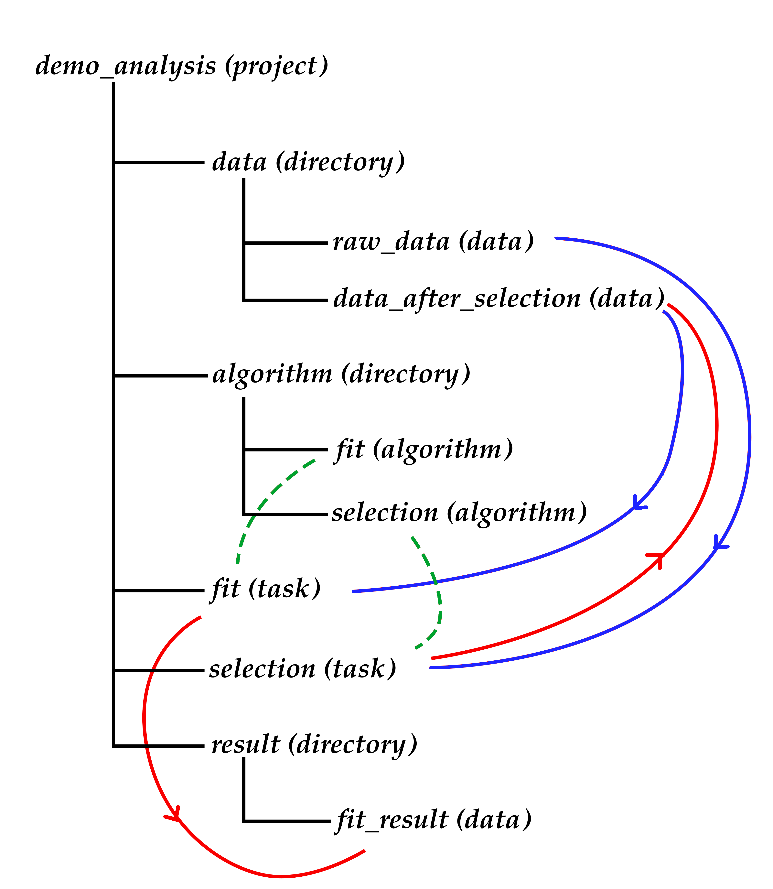

.. Chern documentation master file, created by
   sphinx-quickstart on Sat Jul 15 19:59:40 2017.
   You can adapt this file completely to your liking, but it should at least
   contain the root `toctree` directive.

Chern documentation
=================================
在高能物理实验的数据分析工作中，我们常常需要面对的是对于数据采用不同的方法进行处理。
然而，随着实验的进展，我们需要不断地进行参数和模型的更新等工作。这时，不断的更新会
导致我们的程序与数据越发凌乱。我们在此希望提供的是一个帮助大家对分析进行项目管理的
软件框架，使大家的数据分析工作更加条理清楚。

The following is added after ?looking at? the presentation of Sebastian Neubert at LHCb Analysis and Software Week, on July 18th, 2017.
下面的部分是在听了Sebastian Neubert 6月18日在LHCb Analysis and Software Week上的报告后添加的。目的是为了说明这个软件设计的功能和方法。
使更多的人尽快参与到这个项目中来。

对于保存分析来说，我建议强制用户使用git并且写readme。
最好的方法来强制用户做我们想要他们做的事是重写shell，把shell的每一步都设定成强制记录等等。在这里，我建议采取的方法是修改ipython。即使用ipython作为shell，并且修改mkdir mv rm等等命令的功能。

工作流：
首先我想把在分析中需要的一些要素抽象成一些点。这些点包括数据、算法和任务。
我把工作流的元素分为如下几种：算法，任务和数据。算法的意思是要运行的程序代码和编译命令，snakemake似乎提供了一个很好的工具。任务表示算法的运行，它提供算法所要求的参数和输入输出文件。data表示数据，但是不是真实存在的数据，而是表示一个应该存在的数据。在分析运行之前，指定好每一个任务所需要的输入数据，输出数据和参数、算法。这样，数据和算法一定会形成一个有向无环图，这个图通过指定的顺序或者什么顺序等等就能运行。
分析的修改，从抽象的角度来说，分析的修改就是对这样的一个图，删除一些节点，然后再增加一些节点。重新运行的时候，只需要将更改过的节点以及影响到的后续节点重新运行。

物理位置：
对于数据、算法和任务这些抽象的要素应该放在一些具体的物理位置。我们的抽象节点不可能并列成一排，也应该按一定的逻辑来组织，这个逻辑应该是一些内容的分类。所以我希望把所有的算法、任务和数据都设定成目录。用这种方法来查看。

举个粒子：
比如说，一个分析是从data经过selection1、selection2和fit得到结果，那么，我们的抽象节点应该有

demo analysis structure (mad by Shunan Zhang)

data
selection1_algorithm
selection2_algorithm
fit_algorithm
selection1_task
data_after_selection1
selection2_task
data_after_selection2
fit_task
fit_result
并且在分析之前就应该设定好。
并且指定selection1_task使用selection1_algorithm, 输入文件为data，输出文件为data_after_selection1。
在运行的时候，从data开始运行，程序发现data应该是一个数据，结束。然后运行selection1_algorithm。发现它的依赖是data，运行
.. _fig_0601:

.. figure:: fig/liuchengtu1.png

fig1

For the purpose of preservation, I recommend to force users to use git lab and write readme.
The best approach to f

Contents:

.. toctree::
   :maxdepth: 2

   schedule
   installation
   start
   module
   developerguide

